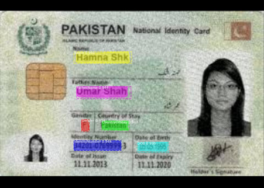

# Object-Detection Using MASK RCNN

This project has been created on Jupyter Notebook in Python. It is primarily based on the MASK RCNN implementation for object detection available at https://github.com/matterport/Mask_RCNN.git. MASK RCNN technique has been used to train a model which detects the fields like name, age, gender etc in Identity Cards. The implementation of the project is in ``ObjectDetectionMRCNN.ipynb`` file. The details of the project are stated below. 

## Dataset
The dataset consists of 2 different types of identity cards. These include
* Pakistan passport - 12 Images
* Pakistan CNIC - 25 Images

To identify the fields, annotation technique is applied on the dataset. ``makesense.ai`` is used for image annotation, which is an open source and free to use image annotator, it annotates the images using AI. Each of the identity card is annotated with the following labels.
### Pakistan passport
*	Surname
*	Given Name
*	Nationality
*	Date of Birth
*	Gender
*	Father Name
 
### Pakistan CNIC
*	Name
*	Father Name
*	Gender
*	Date of Birth
*	Identity Number
*	Country of Status

Since this dataset was quite small, we generated more through data augmentation. Using data augmentation methods like scope, rotate, flip, and zoom, 100 images from a single image are generated with the following results.
* Pakistan passport - 1200 Images
* Pakistan CNIC	- 2500 Images

The augmented data is annotated as well in such a way that when the image is augmented, corresponding object bounding boxes are also augmented accordingly.

## Object Detection Using Transfer Learning
### Classes
To train the model, two types of cards has been used where both cards have 6 fields as mentioned above. Some fields were common and therefore, the number of classes are reduced to unique fields of both cards. This made the total classes up to 9, given below. Each class is assigned a corresponding class id.

1.	Name
2.	Father Name
3.	Gender
4.	Country of Stay
5.	Identity Number
6.	DOB
7.	Surname
8.	Given Name
9.	Nationality

### Model Overview
Mask RCNN is a deep neural network aimed to solve instance segmentation problem in Computer Vision. There are two stages of Mask RCNN. First, it generates proposals about the regions where there might be an object based on the input image. Second, it predicts the class of the object, refines the bounding box and generates a mask in pixel level of the object based on the first stage proposal. Both stages are connected to the backbone structure.

#### Backbone:
ResNet101 is used as backbone architecture to extract features from the images.

#### Pretrained weights:
COCO pretrained weights are used for training the model.

#### Layers removed:
While training the model, the head layers have been removed only. The argument ‘layers’ is set as ‘heads’ in model.train(). This freezes all the layers except the head layers.

#### Hyperparameters:
Epochs = 10
Steps per epoch = 131 
Learning rate = 0.001 
Confidence threshold ~ 0.8

### Results
The model is trained on 10 epochs as it is trained on CPU. The losses were stored in each epoch for training and validation datasets. The accuracy is calculated using the mean Average Precision. One of the predictions is shown below.

### Accuracy
The accuracy of the model for CNIC predictions is about 93% while for Passport predictions it is 88%. 

